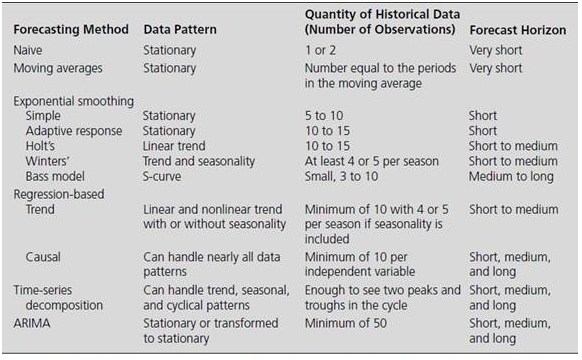

```{r libraries,include=FALSE}
library(knitr)
```


# Exploring Patterns + forecasting techniques

*This chapter will elaborate on how one identify patterns in data thus how to account for this. Thus, we are looking into smoothing methods and moving averages*

*Additionally, we will explore how we select forecasting methods*

**Literature:**

+ HW: Exploring Data Patterns and an Introduction to Forecasting Techniques
+ HW: Moving Averages and Smoothing Methods
+ Armstrong, J.S. (2001) “Selecting Forecast Methods”, In Principles of Forecasting: A Handbook for Researchers and Practitioners (Ed. J. Scott Armstrong), Kluwer

## The forecasting process

*The following describe the forecasting process, hence what one must consider before performing the forecast and ultimately using the forecasts, the purpose of the process is to make sure that the forecast is reliable*

1. Specify objectives
    + Reason for the forecast
    + Applications based on the forecast
    + Good communication between all those involved
    
2. Determine what to forecast
    + Based on set objectives, choose key indicator(s)
    + *Example: domestic sales, export sales, or even both?*
    
3. Identify time dimension
    + Length and periodicity of the forecast
    + Desired frequency
    + Urgency of the forecast
    + Planning of the forecast
    
4. Data considerations
    + Available and quantity of the data
    + Internal vs. external data
    + Desired frequency in data (annual, quarterly, monthly)
    + *Example: Dollar sales instead of unit sales*
    
5. Model selection
    + The pattern exhibited by the data
    + The quantity of historic data available
    + The length of the forecast horizon
    
```{r,echo=FALSE,fig.cap="Model Selection"}

```

6. Model evaluation
    + Testing the models on the series to be forecast
    + Checking how each model works 'in sample'
    + Measures such as MSE, RMSE, etc. used to rank models
    + Fit (in sample) vs. accuracy (out of sample)
    
7. Forecast preparation
    + Based on the selected model, obtain the forecast
    + Keep possibly competing models
    + See if their combination yields mode accuracy
    
8. Presentation of forecast result
    + Clear communication
    + Keep it as simple as possible
    + Visual aids to support the findings
    
9. Tracking results
    + Comparison of forecasts to actual values
    + Re-specify the selected model(s) over time if necessary
    + Try other model combinations to keep the accuracy level intact
    
**Conclusion:** One should realize that it is an iterative process, that one must be aware of.


