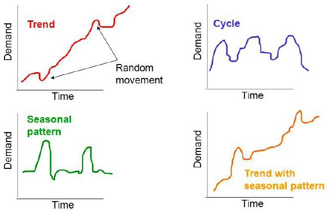
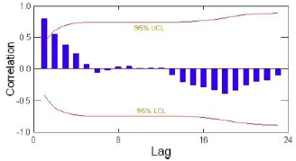

```{r libraries,include=FALSE}
library(knitr)
library(readxl)
library(forecast)
```


# Exploring Patterns and Forecasting Techniques

*This chapter will elaborate on how one identify patterns in data thus how to account for this. Thus, we are looking into smoothing methods and moving averages*

*Additionally, we will explore how we select forecasting methods*

**Literature:**

+ HW: Exploring Data Patterns and an Introduction to Forecasting Techniques
+ HW: Moving Averages and Smoothing Methods
+ Armstrong, J.S. (2001) “Selecting Forecast Methods”, In Principles of Forecasting: A Handbook for Researchers and Practitioners (Ed. J. Scott Armstrong), Kluwer

## The forecasting process

*The following describe the forecasting process, hence what one must consider before performing the forecast and ultimately using the forecasts, the purpose of the process is to make sure that the forecast is reliable*

1. Specify objectives
    + Reason for the forecast
    + Applications based on the forecast
    + Good communication between all those involved
    
2. Determine what to forecast
    + Based on set objectives, choose key indicator(s)
    + *Example: domestic sales, export sales, or even both?*
    
3. Identify time dimension
    + Length and periodicity of the forecast
    + Desired frequency
    + Urgency of the forecast
    + Planning of the forecast
    
4. Data considerations
    + Available and quantity of the data
    + Internal vs. external data
    + Desired frequency in data (annual, quarterly, monthly)
    + *Example: Dollar sales instead of unit sales*
    
5. Model selection
    + The pattern exhibited by the data
    + The quantity of historic data available
    + The length of the forecast horizon
    
```{r,echo=FALSE,fig.cap="Model Selection"}
include_graphics("Images/04/ModelSelection.png")
```

6. Model evaluation
    + Testing the models on the series to be forecast
    + Checking how each model works 'in sample'
    + Measures such as MSE, RMSE, etc. used to rank models
    + Fit (in sample) vs. accuracy (out of sample)
    
7. Forecast preparation
    + Based on the selected model, obtain the forecast
    + Keep possibly competing models
    + See if their combination yields mode accuracy
    
8. Presentation of forecast result
    + Clear communication
    + Keep it as simple as possible
    + Visual aids to support the findings
    
9. Tracking results
    + Comparison of forecasts to actual values
    + Re-specify the selected model(s) over time if necessary
    + Try other model combinations to keep the accuracy level intact
    
**Conclusion:** One should realize that it is an iterative process, that one must be aware of.


## Data Patterns and terminology

*Basically the data is assumed to consist of up to four components, that is:*

1. Trend
    + Long-term change in the level of data
    + Positive vs. negative trends
    + Stationary series *have no trend*
    + *Example: Increasing technology leading to increase in productivity*
    
2. Seasonal
    + Repeated regular variation the level of data
    + *Example: Number of tourists in Mallorca*
    
3. Cyclical
    + Wavelike upward and downward movements around the long-term trend
    + Longer duration than seasonal fluctuations
    + *Example: Business cycles*
    + *Note, this is very often to identify*

4. Irregular
    + Random fluctuations
    + Possibly carrying more dynamics than just deterministic ones
    + Hardest to capture in a forecasting model
    
The four components may look similar to this:

```{r,echo=FALSE,fig.cap="Components in a timeseries"}

```


### Terminology

$Y_t$: Denotes a time series variable

$\hat{Y_t}$: Denotes the foretasted value of $Y_t$ 

$e_t=Y_t-\hat{Y_t}$: Denotes the residual or the forecast error.

$Y_{t-k}$: Denotes a time series variable lagged by *k* periods.

#### Autocorrelation

**Autocorrelation**: is the correlation between a time series and its past (lagged) observations. To identify this, one can merely compare the lagged values as a series for itself, hence comparing actual time series against the lagged time series. This can be written as:

$$r_k=\frac{\sum_{t=k+1}^n\left(Y_{t\ }-\hat{Y}\right)}{\sum_{t=1}^n\left(Y_t-\hat{Y}\right)^{^2}}$$

Where $k = 0,1,2,...$, hence take on numbers, typically whole numbers, as the result must be measurable.

We assess autocorrelation to identify if the data have a trend, seasons, cycles or it is random? If we have seasons, trends or cycles, we must make the model account for this, otherwise one is prone to have a model where it is just implicitly correlated, but that is merely due to the autocorrelation, as it says in the word, it is automatically correlated, but that also implies, that it is not necessarily caused by the data, but rather other factors, often we see macro factors, that have an influence, e.g. an economic book.

Autocorrelation can be plotted using an autocorrelation function (ACF) or merely by using a correlogram, which is a k-period plot of the autocorelation, that looks like the following:

```{r,echo=FALSE,fig.cap="Correlogram Example"}

```

Where one wants to be within the upper and lower level.

**Manually testing for autocorrelation**

One must:

1. Calculate $r_k$
2. Calculate $SE(r_k)$
3. Hypothesis: $H0 : \rho=0$, $H0 : \rho≠0$
    + We apply t-test
    
Where:
$$SE\left(r_k\right)=\sqrt{\left\{\frac{1+2\sum_{i=1}^{k-1}r_i^2}{n}\right\}}$$
Although, with normal approximation
$$SE\left(r_k\right)=\frac{1}{\sqrt{n-k}}$$

and test statistic equal
$$t=\frac{r_k}{SE(r_k)}$$

Thence one merely must look up the cut off values and assess if there is statistical evidance for autocorrelation or not.


**Alternative: Ljung-Box Q statistic**

*The Ljung Box Q is to identify if at least one of the components explains the Y. Thence H0 = p1 = p2 = p3 = pm, thence we want to reject this one. If not, then none of the predictors explain the Y, thus they are irregular components.*

$$Q\ =\ n\left(n+2\right)\sum_{k=1}^m\frac{r_k^2}{n-k}$$

Where *m* is the number of lags to be tested.

The Q statistic is commonly used for testing correlation in the residuals of a forecast model and the comparison is mate to $X^2_{m-q}$, where q is the number of parameters in the model.


#### Random vs. correlated data

Randomness is important for forecast model residuals. One can write simple random model, **but we dont want complete randomness**. Hence we don't want patterns in our error, where the previous error can explain the next error. E.g. if the data contain trend or seasons, that we have not accounted for, then the errors will be able to predict the coming errors (can be tested by testing errors (residuals) against the lagged errors (residuals)).

$$Y_t=c+\epsilon_t$$

Where c is the component and $\epsilon_t$ is the random error component. That is assumed to be uncorrelated period to period.

#### Stationary vs. non stationary data

**Stationary series** is not trending, where is **non stationary series** is trending, can both be linear or exponential.

**The how is it solved?**

One can merely apply differencing of order k. That is equal to:

$$\Delta Y_t=Y_t-Y_{t-1}$$

One could also apply growth rates are log differencing instead.


## Data Patterns and Model Selection {#DataPatternsAndModelSelection}

*Here are some examples from the lectures*

+ Tend, no cycle, no seasonality
    + Holt's exponential Smoothing
    + Linear regression with trend
    
+ Trend, seasonality, cycle
    + Winters' exponential smoothing
    + Linear regression with trend and seasonal adjustments
    + Causal regression
    + Time-series decomposition
    
+ Non linear trend, no seasonality, no cycle
    + Non linear regression with trend
    + Causal regression
    + Holt's exponential smoothing
    
Learn more about the methods in section \@ref(ForecastMethods), where a collection of performance measures can be found in section \@ref(PerformanceMeasurements)


## Exercises

*This section contain exercises, hence the methods applied on data*

### p. 92 HW Problem 8

#### Moving Averages

```{r}
df <- read_excel("Data/Week45/prob8p92HW.xlsx")
yt <- ts(df) #Rename and define as time series
ts.plot(yt) #We can plot the
```

We see that there is a trend in the data.

We can calculate the five period moving average by:

```{r}
yt5c <- ma(yt #The time series
           ,order = 5 #Amount of periods to be evaluated
           ,centre = TRUE #We want the center value of the MA
           )
yt5c
```

Hence we are able to produce moving averages based on the data. Notice, that the most recent MA is the prediction, hence being $\hat{Y}_{t+1}$.

One could extend this, by adding this value to the time series and then calculate MA for the period hereafter. We see that the output of the table above is somewhat misleading, as the most recent MA predictinos, are not positioned in the end, but instead where the center actually is.

This problem is solvable using `filter()`. See the following chunk

```{r,fig.cap="5k Moving Average"}
k <- 5 #specify the order of the moving average
c <- rep (1/k,k) #remember that simple average is a weighted average with equal weights, 
                #you need to specify weights for the filter command to work
yt5<- filter(yt, c, sides = 1)
ts.plot(yt5)# "Plotting the MA's
yt5 #The updated vector of MA's
```

This we see, that scores are moved to the end, so even though it is the center of the MA, it is now presented as recent values.

For simple moving averages, one may do it in excel, it may be easier and quicker.

#### Exponential moving averages, normal, Holts and Winters

**Simple exponential smoothing**

Where;
  
+ alpha is the smoothing parameter, 
+ beta tells you if you should account for a trend or not, 
+ gamma is responsible for the presence of a seasonal component in the model

```{r}
fit <- HoltWinters(yt
                   ,alpha = 0.4
                   ,beta = FALSE
                   ,gamma = FALSE)
plot(fit,xlim = c(1,nrow(df))) + grid(col = "lightgrey")
legend("topleft",c("Observed","Fitted"),lty = 1,col = c(1:2))
```

Hence we see the smoothed values, where the higher alpha, the more will the fitted line track the changes in the observations.

We can now plot the forecast values:

```{r,fig.cap="Forecast Exponential Smoothing"}
plot(forecast(fit),xlim = c(1,nrow(df)+10))# + grid(col = "lightgrey")
legend("topleft",c("Observed","Forecast"),lty = 1,col = c("Black","Blue"))
```

One see the confidence intervals of the forecast widening as we get further away from the actual values.

Now one may assess the accuracy:

```{r}
accuracy(forecast(fit))
```

One see an RMSE of 8.2. Hence one could compare it with an exponential smoothing, which is more sensitive to the observations.

```{r}
fit0.6 <- HoltWinters(yt
                   ,alpha = 0.6 #Changed
                   ,beta = FALSE
                   ,gamma = FALSE)
accuracy(forecast(fit0.6))
```

Where we see an RMSE of 6.37, hence lower than the initial test.


```{r cleaning environment,include=TRUE}
rm(list = ls())
```


