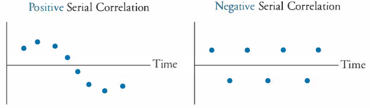
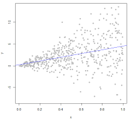

```{r Libraries,include=FALSE}
library(lmtest)
library(tibble)
```


# Simple and Multiple Linear Regression

**Lectures**

+ 5th lecture - simple linear regression
+ 6th lecture - multiple linear regression


**Literature**

+ HW: Simple Linear Regression
+ 

## Simple Linear Regression

I will not go much in details with what simple linaer regression is.

One can calculate the beta values by the following

\begin{equation}
b_0=\ \overline{Y}-\ b_1\overline{X}
(\#eq:b0)
\end{equation}

\begin{equation}
b_1=\frac{\sum_{ }^{ }\left(X-\overline{X}\right)\left(Y-\overline{Y}\right)}{\sum_{ }^{ }\left(X-\overline{X}\right)^{^2}}
(\#eq:b1)
\end{equation}

Where point forecast, hence $\hat{Y}$ is merely the sum of the linear equation, hence $\hat{Y}=b_0+b_1X^*$, where $X^*$ is the specific X values. Thence one can estimate the standard error by:

\begin{equation}
s_{yx}=\sqrt{\frac{\sum_{ }^{ }\left(Y-\overline{Y}\right)^{^2}}{n-2}}
(\#eq:SELinear)
\end{equation}

*Equations \@ref(eq:SELinear) can also be written otherwise, see the slides for that.*

**The residuals can be broken down to the following**


\begin{equation}
\sum_{ }^{ }\left(Y-\overline{Y}\right)^{^2}=\sum_{ }^{ }\left(\hat{Y}-\ \overline{Y}\right)^{^2}+\sum_{ }^{ }\left(Y-\ \hat{Y}\right)^{^2}
(\#eq:error)
\end{equation}

Which consist of the following three elements.

\begin{equation}
SST = SSR + SSE
(\#eq:error2)
\end{equation}

The residuals can then be applied for a goodness of fit assessment, where one can identify R squared- 

\begin{equation}
R^2=\frac{SSR}{SST}
(\#eq:error2)
\end{equation}

***So what can the linear regression then be used for?***

1. Inference
2. Prediction

*Notice, that inference can only be done when the model is adequate, hence the assumptions actually being met.*

### Assumptions

We have the following assumptions for a linear model:

1. The underlying relationship between dependent and independent variable is actually linear
2. Independent residuals
3. Homoskedastic residuals (show constant variance)
4. Identically distributed (In general, normal distribution is assumed)

**Hence how is the assumptions tested?**

Some can be done before analysis and others after the model is applied, hence it can be described by the following:

+ Before the model is applied:
  1. The underlying relationship between dependent and independent variable is actually linear
  
+ After the model is applied (doing diagnostics):
  2. Independent residuals
  3. Homoskedastic residuals (show constant variance)
  4. Identically distributed (In general, normal distribution is assumed)
  
**Now lets dive into the data**

***Serial correlation and Heteroskedasticity***

*Notice that autocorrelation = serial correlation*

Serial correlation is where the observations are trailing each other, where heteroskedasticity is where the variance is changing over timer:

#### Serial correlation (checking for independent residuals):

We must make sure that the residuals does not have a clear pattern, as that means that some variables has been omitted. This can be assessed for example by:

+ Visual inspection
+ Durbin Watson test, see equation \@ref(eq:DurbinWatsonTest)
+ Correlogram
+ Statistical test for relationship between residuals and lagged residuals

```{r,echo=FALSE,fig.cap="Serial Correlation Example"}

```

Notice, that one should also test for autocorrelation in the errors, that can be done with a Durbin-Watson statistic:

\begin{equation}
DW\ =\frac{\sum_{ }^{ }\left(e_t-e_{t-1}\right)^{^2}}{\sum_{ }^{ }e_t^{^2}}
(\#eq:DurbinWatsonTest)
\end{equation}

0 < DW < 4, where if DW = 2 it indicates no serial correlation (this is the ideal), generally if 1.5 < DW < 2.5 is widely used as an acceptable level.

If DW > 2, it indicates negative serial correlation and if DW < 2, it indicates that there is positive serial correlation.

*One could also use correlation testing by checking correlogram of residuals or testing residuals against lagged residuals*

**Solution**

+ Try with lagging the variables

#### Heteroskedasticity:

We want the variance to have a constant variance. This can be checked visually, where we dont want to see a funnel shape, as in the visualization below.

```{r,echo=FALSE,fig.cap="Heteroskedasticity Example"}

```

This can also be tested with a Breusch-Pagan Test, where the null hypothesis is that all errors are equal, hence null hypothesis, is that the errors are homoskedastic.

**Solution**

+ Try lagging the variables
+ Try applying differences in the observations

If one observe heteroskedasticity and can't get rid of it, then one can apply a generalized least squares method. Although this introduce a set of new assumptions.

### Forecasting with a linear trend

*If the data contain a __linear__ trend, then we are able to make the model account for this trend.*

Hence we are able to detrend the data, by including a counter as a variable.

Another solution may be to using the differences in the observations, e.g., using growth rates.

**This is important, as if one don't detrend the data, then the model will merely describe the trend and not the actual values behind the trend, thus you want the model to account for the trend**


### Exercises

#### Problems 5 pp. 209 

```{r}
df <- read_excel("Data/Week46/prob5p209.xlsx")
plot(x = df$Age,y = df$MaintenanceCost,) + grid(col = "lightgrey") + abline(reg = lm(MaintenanceCost ~ Age,data = df))
```

```{r}
coef(object = lm(MaintenanceCost ~ Age,data = df))
```

**If age is the dependent variable**
We see that the intercept is - 1.78, indicating that if there are no maintenance costs, then the age of the vehicle is -1.78 years old, which is naturally not possible, hence we see that the linear relathionship indicates that there will always be maintenance costs.

**If maintenance cost is the dependent variable**
We see that the intercept is 208, hence there will be a begin maintenance of 208, which will always be there, and then for each year, it is expected to increase with about 71.

We can then test to see if the relationship is significant from a statistic point of view.

```{r}
lm(Age ~ .,data = df) %>% summary()
```

We see that there is statistical evidence to say that the relationship is linear. Also the coefficient of determination is 86% hence 86 of the variance is explained by the x variable.

Now we can do the diagnostics:

```{r}
plot(lm(Age ~ .,data = df))
```

+ Before the model is applied:
  + The underlying relationship between dependent and independent variable is actually linear, **This we must assume**

+ After the model is applied (doing diagnostics):
  + Independent residuals **We dont say any indication that the residuals are not independent.**
  + Homoskedastic residuals (show constant variance) **The variance appear to be constant**
  + Identically distributed (In general, normal distribution is assumed) **This we must assume**
  
```{r cleaning the environment}
rm(list = ls())
```


#### Problem 11 p. 212 HW


#### Cases 2 HW 

Notice that the X is deviations from 65 degrees, as 65 degrees is the ideal for the production, hence when one read 10 degrees, then it is in fact 75 degrees or 55. Notice that the deviation is in absolut values.

```{r,fig.cap="Plotting the model"}
df <- read_excel("Data/Week46/Case2p222.xlsx")
#head(df) #To see the first observations in each
Y <- df$Y
X <- df$X
scatter.smooth(x=X, y=Y, main="Y ~ X")
```

```{r}
cor(Y, X)
```

We see that the correlation is negative, hence -0.8

```{r}
linMod <- lm(Y ~ X) #To omit intercept when necessary, the formula can be written for example as lm(cost ~ age - 1)
summary(linMod)
```

We see an R square of 62.47 indicating that the linear relationship is not describing the relationship in the sample data very well, which the illustration above also show quite well.

```{r,fig.cap="Residuals Case 2"}
plot(resid(linMod))
```

Now we can assess if the data show autocorrelation. That can be done by using the `acf()`

```{r,fig.cap="Correlogram"}
acf(resid(linMod)) # white noise residuals?
```

The data appear to show white noise, although there appear to be some pattern, which may show seasons in the data.

We can test to see if the residuals actually show constant variance, of the variance is not constant (heteroskedasticity)

```{r}
bptest(linMod) # Breusch-Pagan test H_0: variance is constant.
```

Since the p value is not significant, there is not enough evidance to reject the null hypothesis, hence we may assume that the residuals show constant variance.

```{r}
{ AIC(linMod) %>% print()
  BIC(linMod) %>% print()}
```

We see the different information criteria, but we need other models to assess what is good and what is bad.

**Q1 How many units would your forecast for a day in which the high temperatire is 80 degrees**

```{r}
a <- data.frame(X=24) #65+24=89 degrees
predict(linMod, a) %>% print()
```

Hence we may expect 338 units to be produced on a day with 89 degrees.

**Q2**

When the degrees is 41, hence also a deviation of 24 degrees.

**Q3 Is the forecasting tool effective?**

We saw earlier that 80% of the variance is explained, although there is probably room for optimization


```{r}
rm(list = ls())
```


#### Case 3 from HW

```{r}
df <- read_excel("Data/Week46/Case2p222.xlsx")
#head(df) #To see the first observations in each
Y <- df$Y
X <- df$X
plot(X,Y)
cor(Y, X)
```

We see that the correlation is negative, hence -0.8

```{r}
cor.test(Y,X)
```


#### Detrending thorugh regression: CO2


```{r,fig.cap="CO2 data"}
CO2levels <- read_excel("Data/Week46/CO2levels(1).xlsx")

y <- ts(CO2levels, frequency = 12) #Monthly series, so we specify the frequency=12.
trend <- seq(1:length(y)) #Creating the linear trend, simply a counter

plot(y)
```

We see that there is a trend and cycles. This we want to get rid of, by enabling the model to account for that.

```{r,fig.cap="Detrended series"}
fit <- lm(y ~ trend)
summary(fit)

ystar <- resid(fit) #ystar is the detrended series, which is simply the residuals from the previous regression.

plot(ystar) + lines(ystar, col="red")
```

Now wee see that the data show constant variance and appear to be stationary around a mean of 0.

But did we get rid of the seasonality?

To compare, one can print the detrended and the initial data.

```{r,fig.cap="Correlogram comparison detrended"}
par(mfrow = c(2,1))
acf(y, 50)
acf(x = ystar,lag.max =  50) #We can specify how many lags we want to plot. Here I just chose 50. 
```

Hence we see that we got rid of the trend, but still see that there is great seasonality in the data.

**Alternative to detrending --> differencing**

*An alternative to detrending with the trend variable, is to using differencing*

```{r,fig.cap="Detrending using differencing"}
dy <- diff(x = y,lag = 1)
plot(dy) #
acf(dy, 50)
```


## Multiple Linear Regression

Simply regression with more than one independent variable.

The diagnostics tools are the same as before, significance testing, R square, DW stats, residuals diagnostics.

### Multicollinearity

Although in MLR one must be aware of **multicollinearity**, meaning that do we see a strong relationship between independent variables, hence are they explaining the same?

To assess for multicollinearity one can apply VIF, which is the following:

\begin{equation}
VIF_j=\frac{1}{1-R^2_j}
(\#eq:VIFTest)
\end{equation}

Where $j = 1,...,k$

Thus, we see that Rsquare is obtained from regression each IDV against the remaining variables. We can then have the following outputs:

+ VIF = 1, no milticollinearity
+ VIF > 10, indicates multicollinearity

If one gets an indication of multicollinearity, then one should drop one of the correlated variables.


