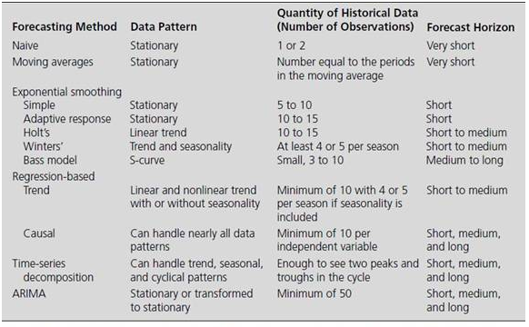
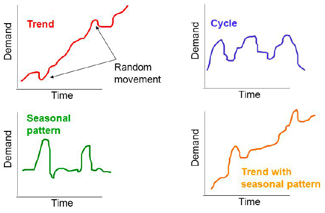

```{r include=FALSE, cache=FALSE}
#' before_chapter_script
rm(list = ls(all = TRUE))
```
# setup {-}

All the output formatting is done in the _output.yml file while all bookdown rendering options is done in the _bookdown.yml file.§

```{r setup,include=FALSE}
knitr::opts_chunk$set(echo = TRUE
                      ,message = FALSE
                      ,error = FALSE
                      ,warning = FALSE
                      ,strip.white = FALSE #To remove white space before and after chunk in output
                      ,fig.align = 'center'
                      ,fig.width = 5
                      )
```


```{r}
library(bookdown)
```

**Tips and tricks**

*Referencing*

This is making a figure with a caption and where we center the figure and set the size. Notice, that the figure is automatically numbered according to the chapter number.

```{r nice-fig, fig.cap="A fig", out.width='80%', fig.asp=.75, fig.align='center'}
plot(pressure,type = 'b',pch = 19)
```

Now we are able to make a reference to the chunk.

Refer to a chunk: \@ref(fig:nice-fig)

*Options*

[RMarkdown Reference Guide](https://www.rstudio.com/wp-content/uploads/2015/03/rmarkdown-reference.pdf?_ga=2.47682403.59925266.1608407175-330761457.1608407175)


<!--chapter:end:index.Rmd-->

```{r include=FALSE, cache=FALSE}
#' before_chapter_script
rm(list = ls(all = TRUE))
```
# Introduction


<!--chapter:end:01-Introduction.Rmd-->

```{r include=FALSE, cache=FALSE}
#' before_chapter_script
rm(list = ls(all = TRUE))
```
# Curriculum

Description of qualifications (Expectations from you): This course will provide you with the ability to:

+ Understand and argue why forecasting is important and discuss different approaches/strategies/principles implemented in the business world.
+ Explain the key difference between qualitative and quantitative methods in forecasting.
+ Reason and argue for which model to use in the face of real-world business situations.
+ Carry out static and dynamic forecasting based on linear regressions and time-series methodology.
+ Evaluate the accuracy of forecast outcomes.

Contents: This course is designed to give a solid theoretical and applied background to graduate students in forecasting. Students are expected to have taken Quantitative Research Methods, or an equivalent course that covers regression analysis with a good understanding of the statistical methodology used. The course will not only be a methodology course but equally an applied course in that students will develop skills to approach business life situations critically, evaluate and communicate their findings with ease. The applications that immediately follow the theoretical topics to be taught will cover different business topics including quality control, product demand analysis, marketing and advertising.
Tentative Outline of Course Topics:

1. Qualitative Forecasting Methods
    + Quantitative and qualitative forecasting
    + New product forecasting + Executive opinions
    + Sales forces opinions
    + Consumer surveys
    + Delphi method

2. Forecast process, data considerations and model selection
    + Trend, seasonal, cycle and irregular components + Statistical review
    + Correlograms

3. Moving average and exponential smoothing methods
    + Moving average
    + Holt’s and Holt-Winter’s exponential smoothing models + Product demand forecasting

4. Forecasting with static regression methods
    + Bivariate regression model review
    + Forecasting with simple linear trend
    + Serial correlation and heteroskedasticity

5. Time-series decomposition
    + Basic time series decomposition models + Deseasonalizing and seasonal indices
    + Time-series decomposition forecast
    + Applications

6. ARIMA processes and Box-Jenkins methodology
    + Moving average models + Autoregressive models
    + Mixed autoregressive and moving average models
    + Model selection, Box-Jenkins identification process, estimation of ARIMA processes
    + Forecasting seasonal time series
    + Applications

7. Dynamic forecasting of economic and financial time series
    + Nonstationary time series + Cointegration
    + Spurious regression

8. Combining forecast results
    + Some basic theorems on diversification of forecasts     + Nelson combination method
    + Granger-Ramanathan combination method
    + Combinations with time-varying weights
    + Applications 

9. Forecast evaluation
    + Measures of forecasting accuracy
    + Diebold-Mariano test for significant differences in forecasting accuracies

<!--chapter:end:02-CourseDescription.Rmd-->

```{r include=FALSE, cache=FALSE}
#' before_chapter_script
rm(list = ls(all = TRUE))
```
# Qualitative Forecasting Methods


– HW: Introduction to forecasting

– HW: Judgmental Forecasting and Forecast Adjustments

– HW: A Review of Basic Statistical Concepts

– Armstrong et al. (2000), “Sales Forecasts for Existing Consumer Products and Services: Do Purchase Intentions Contribute to Accuracy?”, International Journal of Forecasting, 16(3), 383-397.

– Lawrence et al. (2006), “Judgmental forecasting: A review of progress over the last 25 years”, International Journal of Forecasting, 22, 493-518.

– Lynn et al. (1999), “Survey of New Product Forecasting Practices in Industrial High Technology and Low Technology Businesses,” Industrial Marketing Manage- ment, 28, 565-571.

– Bass, Frank M. (1969). “A new product growth model for consumer durables,” Management Science, 15, 215-227.


## Judgmental Forecasting and Forecast Adjustments

A forecast on its own does not include the analysts judgements well enough.

To include experts insights, one can apply different methods for this, that is called judgmental forecasting. There er different methods for including experts input on the analysis. See below:

**The Delphi Method:** That is an iterative process where experts makes analysis an predictions independently, then the findings are distributed and then they are able to independently make corrections to their output if they feel to. The results are then distributed and they are possible to correct their output

The feedback loop ends when they have reached redundancy and they make no more corrections.
	
Thus, the output is different expert views, that you can select between.
	

Scenario writing: you have different experts that write scenarios that are likely to happen in the future, you rank those events after likelyhood.

The scenario writing is followed by discussion. Thus they are able to defend and modify predictions.
	
**Combining forecasts:** This is where you make different predicte analysis perhaps not including the same predictors, then you use the outputs to compute a forecast, that is done either by finding the mean of the forecasts or assigning weights to the different forecasts that now act as predictors.

**Forecasting and Neural Networks:** NN is used to find its own variables, it is particularly good to fill in missing values.
	

Other tools to judgmental decision making:

- The decision making tree, where you assign costs and probabilities to events.

Bayesian statistics, also where you create a tree of probabilities.


## Articles

### A new product growth model for consumer durables,” Management Science

The Bass Model i.e. the Bass Curve is the model for sales of new products, or more correct a generalization of the sales for a product, hence he created the model for adopters, where it has later been separated into innovators, early adopters, early majority, etc. that is then the product life cycle.

Thus the purpose of the Bass Model is to predict sales of a new product, based on questionnaires or early sales

The Bass Curve is based on the early adopters and calculates the curve based on their numbers. The model has proven that it only needs very few observations to plot when it is going to peak and at what amount. Basically the model is based on a conditional likelihood with respect to time.

In fact, it has shown to predict peak and sales amount based on research and questionnaires prior to sales
	
Then there are some notes on what further research that can be done and some notes on extensions to the Bass Model

### Sales Forecasts for Existing Consumer Products
and Services: Do Purchase Intentions Contribute
to Accuracy?

As we know from the Bass Model we can use consumer intentions (questionnaires about whether a person think he will buy it or not) to guestimate the total sales and when it is going to peak, but are we are able to optimize accuracy of forecasts on existing products using consumer intentions?

A previous study has shown, that intentions does not improve the model, although the data did not have available the intentions and whether the person made a purchase or not. In this study there is an improvement to the forecast when the historical data is combined with the intentions of the persons. Also they ruled out, the factor that if the data does not have historical data on intentions and sales history. Hence they experienced on their seven data set, that combining historical data and intentions improved the forecast. To be noted is that the manipulated the intentions in different ways to experiment, e.g. moving average, binary (intentions or not) and some other faucets.

### Judgmental forecasting A review of progress over the last 25 years, International Journal of Forecasting

This is basically just more information on the judgemental forecasting where they tested different set ups, such as groups, bootsstrapping etc. 

Did not read all of this, it seemed very much like HW9


<!--chapter:end:03-QualitativeForecastingMethods.Rmd-->

```{r include=FALSE, cache=FALSE}
#' before_chapter_script
rm(list = ls(all = TRUE))
```

```{r libraries,include=FALSE}
library(knitr)
library(readxl)
library(forecast)
```


# Exploring Patterns and Forecasting Techniques

*This chapter will elaborate on how one identify patterns in data thus how to account for this. Thus, we are looking into smoothing methods and moving averages*

*Additionally, we will explore how we select forecasting methods*

**Literature:**

+ HW: Exploring Data Patterns and an Introduction to Forecasting Techniques
+ HW: Moving Averages and Smoothing Methods
+ Armstrong, J.S. (2001) “Selecting Forecast Methods”, In Principles of Forecasting: A Handbook for Researchers and Practitioners (Ed. J. Scott Armstrong), Kluwer

## The forecasting process

*The following describe the forecasting process, hence what one must consider before performing the forecast and ultimately using the forecasts, the purpose of the process is to make sure that the forecast is reliable*

1. Specify objectives
    + Reason for the forecast
    + Applications based on the forecast
    + Good communication between all those involved
    
2. Determine what to forecast
    + Based on set objectives, choose key indicator(s)
    + *Example: domestic sales, export sales, or even both?*
    
3. Identify time dimension
    + Length and periodicity of the forecast
    + Desired frequency
    + Urgency of the forecast
    + Planning of the forecast
    
4. Data considerations
    + Available and quantity of the data
    + Internal vs. external data
    + Desired frequency in data (annual, quarterly, monthly)
    + *Example: Dollar sales instead of unit sales*
    
5. Model selection
    + The pattern exhibited by the data
    + The quantity of historic data available
    + The length of the forecast horizon
    
```{r,echo=FALSE,fig.cap="Model Selection"}

```

6. Model evaluation
    + Testing the models on the series to be forecast
    + Checking how each model works 'in sample'
    + Measures such as MSE, RMSE, etc. used to rank models
    + Fit (in sample) vs. accuracy (out of sample)
    
7. Forecast preparation
    + Based on the selected model, obtain the forecast
    + Keep possibly competing models
    + See if their combination yields mode accuracy
    
8. Presentation of forecast result
    + Clear communication
    + Keep it as simple as possible
    + Visual aids to support the findings
    
9. Tracking results
    + Comparison of forecasts to actual values
    + Re-specify the selected model(s) over time if necessary
    + Try other model combinations to keep the accuracy level intact
    
**Conclusion:** One should realize that it is an iterative process, that one must be aware of.


## Data Patterns and terminology

*Basically the data is assumed to consist of up to four components, that is:*

1. Trend
    + Long-term change in the level of data
    + Positive vs. negative trends
    + Stationary series *have no trend*
    + *Example: Increasing technology leading to increase in productivity*
    
2. Seasonal
    + Repeated regular variation the level of data
    + *Example: Number of tourists in Mallorca*
    
3. Cyclical
    + Wavelike upward and downward movements around the long-term trend
    + Longer duration than seasonal fluctuations
    + *Example: Business cycles*
    + *Note, this is very often to identify*

4. Irregular
    + Random fluctuations
    + Possibly carrying more dynamics than just deterministic ones
    + Hardest to capture in a forecasting model
    
The four components may look similar to this:

```{r,echo=FALSE,fig.cap="Components in a timeseries"}

```


### Terminology

$Y_t$: Denotes a time series variable

$\hat{Y_t}$: Denotes the foretasted value of $Y_t$ 

$e_t=Y_t-\hat{Y_t}$: Denotes the residual or the forecast error.

$Y_{t-k}$: Denotes a time series variable lagged by *k* periods.

#### Autocorrelation

**Autocorrelation**: is the correlation between a time series and its past (lagged) observations. To identify this, one can merely compare the lagged values as a series for itself, hence comparing actual time series against the lagged time series. This can be written as:

$$r_k=\frac{\sum_{t=k+1}^n\left(Y_{t\ }-\hat{Y}\right)}{\sum_{t=1}^n\left(Y_t-\hat{Y}\right)^{^2}}$$

Where $k = 0,1,2,...$, hence take on numbers, typically whole numbers, as the result must be measurable.

We assess autocorrelation to identify if the data have a trend, seasons, cycles or it is random? If we have seasons, trends or cycles, we must make the model account for this, otherwise one is prone to have a model where it is just implicitly correlated, but that is merely due to the autocorrelation, as it says in the word, it is automatically correlated, but that also implies, that it is not necessarily caused by the data, but rather other factors, often we see macro factors, that have an influence, e.g. an economic book.

Autocorrelation can be plotted using an autocorrelation function (ACF) or merely by using a correlogram, which is a k-period plot of the autocorelation, that looks like the following:

```{r,echo=FALSE,fig.cap="Correlogram Example"}
include_graphics("Images/04/CorrelogramExample.png")
```

Where one wants to be within the upper and lower level.

**Manually testing for autocorrelation**

One must:

1. Calculate $r_k$
2. Calculate $SE(r_k)$
3. Hypothesis: $H0 : \rho=0$, $H0 : \rho≠0$
    + We apply t-test
    
Where:
$$SE\left(r_k\right)=\sqrt{\left\{\frac{1+2\sum_{i=1}^{k-1}r_i^2}{n}\right\}}$$
Although, with normal approximation
$$SE\left(r_k\right)=\frac{1}{\sqrt{n-k}}$$

and test statistic equal
$$t=\frac{r_k}{SE(r_k)}$$

Thence one merely must look up the cut off values and assess if there is statistical evidance for autocorrelation or not.


**Alternative: Ljung-Box Q statistic**

*The Ljung Box Q is to identify if at least one of the components explains the Y. Thence H0 = p1 = p2 = p3 = pm, thence we want to reject this one. If not, then none of the predictors explain the Y, thus they are irregular components.*

$$Q\ =\ n\left(n+2\right)\sum_{k=1}^m\frac{r_k^2}{n-k}$$

Where *m* is the number of lags to be tested.

The Q statistic is commonly used for testing correlation in the residuals of a forecast model and the comparison is mate to $X^2_{m-q}$, where q is the number of parameters in the model.


#### Random vs. correlated data

Randomness is important for forecast model residuals. One can write simple random model, **but we dont want complete randomness**. Hence we don't want patterns in our error, where the previous error can explain the next error. E.g. if the data contain trend or seasons, that we have not accounted for, then the errors will be able to predict the coming errors (can be tested by testing errors (residuals) against the lagged errors (residuals)).

$$Y_t=c+\epsilon_t$$

Where c is the component and $\epsilon_t$ is the random error component. That is assumed to be uncorrelated period to period.

#### Stationary vs. non stationary data

**Stationary series** is not trending, where is **non stationary series** is trending, can both be linear or exponential.

**The how is it solved?**

One can merely apply differencing of order k. That is equal to:

$$\Delta Y_t=Y_t-Y_{t-1}$$

One could also apply growth rates are log differencing instead.


## Data Patterns and Model Selection {#DataPatternsAndModelSelection}

*Here are some examples from the lectures*

+ Tend, no cycle, no seasonality
    + Holt's exponential Smoothing
    + Linear regression with trend
    
+ Trend, seasonality, cycle
    + Winters' exponential smoothing
    + Linear regression with trend and seasonal adjustments
    + Causal regression
    + Time-series decomposition
    
+ Non linear trend, no seasonality, no cycle
    + Non linear regression with trend
    + Causal regression
    + Holt's exponential smoothing
    
Learn more about the methods in section \@ref(ForecastMethods), where a collection of performance measures can be found in section \@ref(PerformanceMeasurements)


## Exercises

*This section contain exercises, hence the methods applied on data*

### p. 92 HW Problem 8

#### Moving Averages

```{r}
df <- read_excel("Data/Week45/prob8p92HW.xlsx")
yt <- ts(df) #Rename and define as time series
ts.plot(yt) #We can plot the
```

We see that there is a trend in the data.

We can calculate the five period moving average by:

```{r}
yt5c <- ma(yt #The time series
           ,order = 5 #Amount of periods to be evaluated
           ,centre = TRUE #We want the center value of the MA
           )
yt5c
```

Hence we are able to produce moving averages based on the data. Notice, that the most recent MA is the prediction, hence being $\hat{Y}_{t+1}$.

One could extend this, by adding this value to the time series and then calculate MA for the period hereafter. We see that the output of the table above is somewhat misleading, as the most recent MA predictinos, are not positioned in the end, but instead where the center actually is.

This problem is solvable using `filter()`. See the following chunk

```{r,fig.cap="5k Moving Average"}
k <- 5 #specify the order of the moving average
c <- rep (1/k,k) #remember that simple average is a weighted average with equal weights, 
                #you need to specify weights for the filter command to work
yt5<- filter(yt, c, sides = 1)
ts.plot(yt5)# "Plotting the MA's
yt5 #The updated vector of MA's
```

This we see, that scores are moved to the end, so even though it is the center of the MA, it is now presented as recent values.

For simple moving averages, one may do it in excel, it may be easier and quicker.

#### Exponential moving averages + Holts and Winters

**Simple exponential smoothing**

Where;
  
+ alpha is the smoothing parameter, 
+ beta tells you if you should account for a trend or not, 
+ gamma is responsible for the presence of a seasonal component in the model

```{r,fig.cap="Exponential Smoothing"}
fit <- HoltWinters(yt
                   ,alpha = 0.4
                   ,beta = FALSE
                   ,gamma = FALSE)
plot(fit,xlim = c(1,nrow(df))) + grid(col = "lightgrey")
legend("topleft",c("Observed","Fitted"),lty = 1,col = c(1:2))
```

Hence we see the smoothed values, where the higher alpha, the more will the fitted line track the changes in the observations.

We can now plot the forecast values:

```{r,fig.cap="Forecast Exponential Smoothing"}
plot(forecast(fit),xlim = c(1,nrow(df)+10))# + grid(col = "lightgrey")
legend("topleft",c("Observed","Forecast"),lty = 1,col = c("Black","Blue"))
```

One see the confidence intervals of the forecast widening as we get further away from the actual values.

Now one may assess the accuracy:

```{r}
accuracy(forecast(fit))
```

One see an RMSE of 8.2. Hence one could compare it with an exponential smoothing, which is more sensitive to the observations.

```{r}
fit0.6 <- HoltWinters(yt
                   ,alpha = 0.6 #Changed
                   ,beta = FALSE
                   ,gamma = FALSE)
accuracy(forecast(fit0.6))
```

Where we see an RMSE of 6.37, hence lower than the initial test.

**Holt's exponential smoothing**

exponential smoothing when a trend component is present: beta = TRUE

```{r,fig.cap="Holt's Exponential Smoothing"}
{fit3 <- HoltWinters(yt
                    ,alpha = 0.6
                    ,beta = TRUE
                    ,gamma = FALSE)
plot(forecast(fit3))
accuracy(forecast(fit3))}
```

We see that the RMSE is even lower (4.37). Which is expected, as Holt's exponential smoothing accounts for trend.

**Winter's Exponential Smoothing**

Which accounts for trend and seasonality

in order to make it work one needs to define the frequency of your seasonal component, when specifying the ts data

```{r}
{yt <- ts(df
         ,frequency = 4) # let's assume we suspect a quarterly pattern
fit4 <- HoltWinters(yt, alpha=0.6, beta=TRUE, gamma=TRUE)
plot(forecast(fit4))
accuracy(forecast(fit4))} # experiment with seasonality frequency to see if you can get any lower in MSE
```

We see that the RMSE is even lower (3.97), hence Winters Exponential Smoothing appear to be the best model for prediction.

```{r cleaning environment,include=FALSE}
rm(list = ls())
```


### p. 93 HW Problem 9-10

Basically just another example of the exercise above.

### CO2 and Sales Data

Not done again. Do if time allows.

### Case 6 oo. 108-111 HW

Not done again. Do if time allows.


<!--chapter:end:04-ExploringPatterns+ForecastingTechniques.Rmd-->

```{r include=FALSE, cache=FALSE}
#' before_chapter_script
rm(list = ls(all = TRUE))
```


```{r Libraries,include=FALSE}
library(lmtest)
library(tibble)
```


# Simple and Multiple Linear Regression

*This chapter elaborates on how linear regression may be applied to forecast data and also how we may get rid of trends when applying linear regression and assesing the assumptions for the model. Lastly, the chapter elaborates on how to chose a model*

**Lectures**

+ 5th lecture - simple linear regression
+ 6th lecture - multiple linear regression


**Literature**

+ HW: Simple Linear Regression
+ How to write business reports - https://www.victoria.ac.nz/vbs/teaching/resources/VBS-Report-Writing-Guide-2017.pdf

## Simple Linear Regression

I will not go much in details with what simple linaer regression is.

One can calculate the beta values by the following

\begin{equation}
b_0=\ \overline{Y}-\ b_1\overline{X}
(\#eq:b0)
\end{equation}

\begin{equation}
b_1=\frac{\sum_{ }^{ }\left(X-\overline{X}\right)\left(Y-\overline{Y}\right)}{\sum_{ }^{ }\left(X-\overline{X}\right)^{^2}}
(\#eq:b1)
\end{equation}

Where point forecast, hence $\hat{Y}$ is merely the sum of the linear equation, hence $\hat{Y}=b_0+b_1X^*$, where $X^*$ is the specific X values. Thence one can estimate the standard error by:

\begin{equation}
s_{yx}=\sqrt{\frac{\sum_{ }^{ }\left(Y-\overline{Y}\right)^{^2}}{n-2}}
(\#eq:SELinear)
\end{equation}

*Equations \@ref(eq:SELinear) can also be written otherwise, see the slides for that.*

**The residuals can be broken down to the following**


\begin{equation}
\sum_{ }^{ }\left(Y-\overline{Y}\right)^{^2}=\sum_{ }^{ }\left(\hat{Y}-\ \overline{Y}\right)^{^2}+\sum_{ }^{ }\left(Y-\ \hat{Y}\right)^{^2}
(\#eq:error)
\end{equation}

Which consist of the following three elements.

\begin{equation}
SST = SSR + SSE
(\#eq:error2)
\end{equation}

The residuals can then be applied for a goodness of fit assessment, where one can identify R squared- 

\begin{equation}
R^2=\frac{SSR}{SST}
(\#eq:error2)
\end{equation}

***So what can the linear regression then be used for?***

1. Inference
2. Prediction

*Notice, that inference can only be done when the model is adequate, hence the assumptions actually being met.*

### Assumptions

We have the following assumptions for a linear model:

1. The underlying relationship between dependent and independent variable is actually linear
2. Independent residuals
3. Homoskedastic residuals (show constant variance)
4. Identically distributed (In general, normal distribution is assumed)

**Hence how is the assumptions tested?**

Some can be done before analysis and others after the model is applied, hence it can be described by the following:

+ Before the model is applied:
  1. The underlying relationship between dependent and independent variable is actually linear
  
+ After the model is applied (doing diagnostics):
  2. Independent residuals
  3. Homoskedastic residuals (show constant variance)
  4. Identically distributed (In general, normal distribution is assumed)
  
**Now lets dive into the data**

***Serial correlation and Heteroskedasticity***

*Notice that autocorrelation = serial correlation*

Serial correlation is where the observations are trailing each other, where heteroskedasticity is where the variance is changing over timer:

#### Serial correlation (checking for independent residuals):

We must make sure that the residuals does not have a clear pattern, as that means that some variables has been omitted. This can be assessed for example by:

+ Visual inspection
+ Durbin Watson test, see equation \@ref(eq:DurbinWatsonTest)
+ Correlogram
+ Statistical test for relationship between residuals and lagged residuals

```{r,echo=FALSE,fig.cap="Serial Correlation Example"}
include_graphics("Images/05/SerialCorrelationExample.png")
```

Notice, that one should also test for autocorrelation in the errors, that can be done with a Durbin-Watson statistic:

\begin{equation}
DW\ =\frac{\sum_{ }^{ }\left(e_t-e_{t-1}\right)^{^2}}{\sum_{ }^{ }e_t^{^2}}
(\#eq:DurbinWatsonTest)
\end{equation}

0 < DW < 4, where if DW = 2 it indicates no serial correlation (this is the ideal), generally if 1.5 < DW < 2.5 is widely used as an acceptable level.

If DW > 2, it indicates negative serial correlation and if DW < 2, it indicates that there is positive serial correlation.

*One could also use correlation testing by checking correlogram of residuals or testing residuals against lagged residuals*

**Solution**

+ Try with lagging the variables

#### Heteroskedasticity:

We want the variance to have a constant variance. This can be checked visually, where we dont want to see a funnel shape, as in the visualization below.

```{r,echo=FALSE,fig.cap="Heteroskedasticity Example"}
include_graphics("Images/05/HeteroskedasticityExample.png")
```

This can also be tested with a Breusch-Pagan Test, where the null hypothesis is that all errors are equal, hence null hypothesis, is that the errors are homoskedastic.

**Solution**

+ Try lagging the variables
+ Try applying differences in the observations

If one observe heteroskedasticity and can't get rid of it, then one can apply a generalized least squares method. Although this introduce a set of new assumptions.

### Forecasting with a linear trend

*If the data contain a __linear__ trend, then we are able to make the model account for this trend.*

Hence we are able to detrend the data, by including a counter as a variable.

Another solution may be to using the differences in the observations, e.g., using growth rates.

**This is important, as if one don't detrend the data, then the model will merely describe the trend and not the actual values behind the trend, thus you want the model to account for the trend**


### Exercises

#### Problems 5 pp. 209 

```{r}
df <- read_excel("Data/Week46/prob5p209.xlsx")
plot(x = df$Age,y = df$MaintenanceCost,) + grid(col = "lightgrey") + abline(reg = lm(MaintenanceCost ~ Age,data = df))
```

```{r}
coef(object = lm(MaintenanceCost ~ Age,data = df))
```

**If age is the dependent variable**
We see that the intercept is - 1.78, indicating that if there are no maintenance costs, then the age of the vehicle is -1.78 years old, which is naturally not possible, hence we see that the linear relathionship indicates that there will always be maintenance costs.

**If maintenance cost is the dependent variable**
We see that the intercept is 208, hence there will be a begin maintenance of 208, which will always be there, and then for each year, it is expected to increase with about 71.

We can then test to see if the relationship is significant from a statistic point of view.

```{r}
lm(Age ~ .,data = df) %>% summary()
```

We see that there is statistical evidence to say that the relationship is linear. Also the coefficient of determination is 86% hence 86 of the variance is explained by the x variable.

Now we can do the diagnostics:

```{r}
plot(lm(Age ~ .,data = df))
```

+ Before the model is applied:
  + The underlying relationship between dependent and independent variable is actually linear, **This we must assume**

+ After the model is applied (doing diagnostics):
  + Independent residuals **We dont say any indication that the residuals are not independent.**
  + Homoskedastic residuals (show constant variance) **The variance appear to be constant**
  + Identically distributed (In general, normal distribution is assumed) **This we must assume**
  
```{r cleaning the environment}
rm(list = ls())
```


#### Problem 11 p. 212 HW


#### Cases 2 HW 

Notice that the X is deviations from 65 degrees, as 65 degrees is the ideal for the production, hence when one read 10 degrees, then it is in fact 75 degrees or 55. Notice that the deviation is in absolut values.

```{r,fig.cap="Plotting the model"}
df <- read_excel("Data/Week46/Case2p222.xlsx")
#head(df) #To see the first observations in each
Y <- df$Y
X <- df$X
scatter.smooth(x=X, y=Y, main="Y ~ X")
```

```{r}
cor(Y, X)
```

We see that the correlation is negative, hence -0.8

```{r}
linMod <- lm(Y ~ X) #To omit intercept when necessary, the formula can be written for example as lm(cost ~ age - 1)
summary(linMod)
```

We see an R square of 62.47 indicating that the linear relationship is not describing the relationship in the sample data very well, which the illustration above also show quite well.

```{r,fig.cap="Residuals Case 2"}
plot(resid(linMod))
```

Now we can assess if the data show autocorrelation. That can be done by using the `acf()`

```{r,fig.cap="Correlogram"}
acf(resid(linMod)) # white noise residuals?
```

The data appear to show white noise, although there appear to be some pattern, which may show seasons in the data.

We can test to see if the residuals actually show constant variance, of the variance is not constant (heteroskedasticity)

```{r}
bptest(linMod) # Breusch-Pagan test H_0: variance is constant.
```

Since the p value is not significant, there is not enough evidance to reject the null hypothesis, hence we may assume that the residuals show constant variance.

```{r}
{ AIC(linMod) %>% print()
  BIC(linMod) %>% print()}
```

We see the different information criteria, but we need other models to assess what is good and what is bad.

**Q1 How many units would your forecast for a day in which the high temperatire is 80 degrees**

```{r}
a <- data.frame(X=24) #65+24=89 degrees
predict(linMod, a) %>% print()
```

Hence we may expect 338 units to be produced on a day with 89 degrees.

**Q2**

When the degrees is 41, hence also a deviation of 24 degrees.

**Q3 Is the forecasting tool effective?**

We saw earlier that 80% of the variance is explained, although there is probably room for optimization


```{r}
rm(list = ls())
```


#### Case 3 from HW

```{r}
df <- read_excel("Data/Week46/Case2p222.xlsx")
#head(df) #To see the first observations in each
Y <- df$Y
X <- df$X
plot(X,Y)
cor(Y, X)
```

We see that the correlation is negative, hence -0.8

```{r}
cor.test(Y,X)
```


#### Detrending thorugh regression: CO2


```{r,fig.cap="CO2 data"}
CO2levels <- read_excel("Data/Week46/CO2levels(1).xlsx")

y <- ts(CO2levels, frequency = 12) #Monthly series, so we specify the frequency=12.
trend <- seq(1:length(y)) #Creating the linear trend, simply a counter

plot(y)
```

We see that there is a trend and cycles. This we want to get rid of, by enabling the model to account for that.

```{r,fig.cap="Detrended series"}
fit <- lm(y ~ trend)
summary(fit)

ystar <- resid(fit) #ystar is the detrended series, which is simply the residuals from the previous regression.

plot(ystar) + lines(ystar, col="red")
```

Now wee see that the data show constant variance and appear to be stationary around a mean of 0.

But did we get rid of the seasonality?

To compare, one can print the detrended and the initial data.

```{r,fig.cap="Correlogram comparison detrended"}
par(mfrow = c(2,1))
acf(y, 50)
acf(x = ystar,lag.max =  50) #We can specify how many lags we want to plot. Here I just chose 50. 
```

Hence we see that we got rid of the trend, but still see that there is great seasonality in the data.

**Alternative to detrending --> differencing**

*An alternative to detrending with the trend variable, is to using differencing*

```{r,fig.cap="Detrending using differencing"}
dy <- diff(x = y,lag = 1)
plot(dy) #
acf(dy, 50)
```

```{r cleaning environment,include=FALSE}
rm(list = ls())
```


## Multiple Linear Regression

Simply regression with more than one independent variable.

The diagnostics tools are the same as before, significance testing, R square, DW stats, residuals diagnostics.

### Multicollinearity

Although in MLR one must be aware of **multicollinearity**, meaning that do we see a strong relationship between independent variables, hence are they explaining the same?

To assess for multicollinearity one can apply VIF, which is the following:

\begin{equation}
VIF_j=\frac{1}{1-R^2_j}
(\#eq:VIFTest)
\end{equation}

Where $j = 1,...,k$

Thus, we see that Rsquare is obtained from regression each IDV against the remaining variables. We can then have the following outputs:

+ VIF = 1, no milticollinearity
+ VIF > 10, indicates multicollinearity

If one gets an indication of multicollinearity, then one should drop one of the correlated variables.

### Serial correlation and omitted variables

When doing regression, we may observe that the IDVs are correlated with the error term, meaning that the errors are not randomly distributed, hence serial correlation in the error terms.

For serial correlation in the error terms, we are able to make use of the Durbin-Watson, see \@ref(eq:DurbinWatsonTest).


### Selection criteria

We cannot use R square anymore, as it will never really penalize when we are adding variables. Hence one should use>

+ AIC
+ BIC

Depending on whether one is interested in the best model for prediction or the true model.


<!--chapter:end:05-SimpleLinearRegression.Rmd-->

```{r include=FALSE, cache=FALSE}
#' before_chapter_script
rm(list = ls(all = TRUE))
```


```{r libraries,include=FALSE}
library(forecast)
library(readxl)
```


# Time-Series Decomposition and Regression with Time-Series Data

*This chapter identifies what elements a time series can be broken into, hence it elaborates on the trend, seasonality, cycles and irregular movements*


**Literature**

+ HW: Time Series and Their Components
+ HW: Regression with Time Series Data


## Time Series and Their Components (HW)

Basically a Time Series is variables that are collected over time. The variables are highly likely to have autocorrelation 

*Autocorellation: Variables are automatically dependant on each other over time, and the mere aspect of these synergies (patterns) where one will often be able to prove correlation between the variables*

One approach to assessing time series is by decomposing the patterns by finding the components hereof, these are:

1. Trend(T): if it is linear, then it can be explained by $\hat{T}_t=\beta_0+\beta_1t$, hence we apply the linear function, hence what in statistics is $\hat{y}=\hat{T}$ in time series

2. Cyclical(T or C)*Note, often included in practice as the trend, as it can be difficult to extinguish*

3. Seasonal(S)

4. Irregular(random)(I)


**The purpose** of decomposing the time series data, can be either for exploration or prediction. Hence you can estimate the coefficients of the components by breaking down the data.

Although the typical purpose of time series is exploration of the data and assess if there are seasons, trends etc. and perhaps to pinpoint whether you are above or below the season/trend/cycle. 

If the Y observations is the sum of the components, then we have **additive model**, if they are the product of the components, then it is called **multiplicative model**

Time series is typically an additive model, if the variance is more or less the same, it is a multiplicative model if the variance increases with time

*Note, one can transform a multiplicative model to an additive model by taking the logarithm*


### Additional on trend

**Quadratic trend**

*e.g. where we have curvature*

$$\hat{T}_t=\beta_0+\beta_1t+\beta_1t^2$$


**Exponential trend**

*e.g. exponentially growing population*

$$\hat{T}_t=\beta_0*\beta_2^t$$

*NOTE, one may transform this into a logistic trend instead, as continuous exponential trend is not typical*

\

### Additional on seasonal pattern

+ One can manually rule out seasonality by adding seasonal index (that is hard coding the expected index in the respective periods)
  + ***One must rule out other factors before doing this!***


**Seasonally adjusted data**

For additive

$$Y_t - S_t = T_t + I_t$$

For multiplicative

$$\frac{Y_t}{S_t} = T_t * I_t$$

One does often take out seasonality to better compare data and also create short term forecasts.


### Cyclical and Irregular Variations

One can often rule out (or at least smooth out) irregularities by taking the moving average

\

## Regression with time series data


One of the assumptions for regression models, is that the errors are independent (uncorrelated), THAT IS RARELY THE CASE WITH TIME SERIES. Hence one must be very precautions.

## The success criteria and process


*The following elaborates on success criteria and the process*

### Success Criteria

*Ultimately we want to be able to answer the following:*

1. Do we have trend?
2. Do we have cyclical movements?
3. Do we have seasons?
4. Do we have autocorellation (elaborated in section \@ref(Autocorellation))? If yes:
    a. If RHO = 1, then we can take first differences
    b. If RHO <> 1, then we can do the generalized differences., thus implies the following:
        1. Do an OLS and get the residuals
        2. Use the residuals in the following equation $e_t=\rho e_{t-1}+ \sigma_t$, using OLS as estimated rho ($\hat{\rho}$)
            a. If rho = 0, then 0 autocorellation


### The Process

**Deseasonalizing and detrending based on moving averages and accounting for cyclical moves**

*Note, if you do not have seasonality, then jump to section 2. trend etc.*

#### Desaesonalizing

a. Remove the short-term fluctuations
b. If we have even number of periods, one must center the data. Whith odd period numbers, you can merely center with the period in the middle. The procedure with even number of periods is the following:

**1. Find the MA_t with equation \@ref(eq:MAt) and \@ref(eq:MAt2)**

\begin{equation}
MA_t = \frac{(Y_{t-2}+Y_{t-1}+Y_{t}+Y_{t+1}+)}{4}
(\#eq:MAt)
\end{equation} and 

\begin{equation}
MA_{t+1} = \frac{(Y_{t-1}+Y_{t}+Y_{t+1}+Y_{t+2}+)}{4}
(\#eq:MAt2)
\end{equation}


*Note, that the MA for each is centered in the center and rounded up to the coming period*

**2. Then find the centered MA**

Then do the average of the two periods, which will find the actual center: 

\begin{equation}
CMA_t=\frac{(MA_t+MA_{t+1})}{2}
(\#eq:CMAt)
\end{equation}

Notice, that the example is with quarterly MA, hence the MAs are divided with 4, this could have been monthly and then onw would divide by 12.

c. $CMA_t$ is representing the depersonalized data.
d. One can find the seasonal factor by saying 

\begin{equation}
SF_t=\frac{Y_t}{CMA_t}
(\#eq:SFt)
\end{equation}

*This explains whether one as above or below the expect season level.*

e. CONCLUSION: IF $SF_t > 1$, then Y is greater than the quarterly (or what other period is used) average or, $SF_t < 1$, then the Y is less than the quarterly average

\
    
> Alternative, deseasonalizing data can be done by dividing the raw data with some seasonal index, that is adding dummy variables for the periods. Although by using the index, one assume, that the same seasonality is the same as preivous periods.

\

#### Long-term trend

Long-term trend, this is estimated from the deseasonalized data. This is estimated using simple linear regression. Basically the detrended data consists of the residuals between the actual data and the estimated data by using the trend variable (the counter 1 to n).

*Task 1*

We must find out if the trend is linear or quadratic.
  
Linear: $C\hat{M}A_t=f(t)=\beta_0 + \beta_1t$

Quadratic: $C\hat{M}A_t=f(t)=\beta_0 + \beta_1t+\beta_2t^2$

Where $t$ is the time indicator and 1 = the first observation and increases by 1 thereafter.

Now we have obtained the centered moving-average trend

\begin{equation}
CMAT = C\hat{M}A
(\#eq:CMAT)
\end{equation}
    
 
#### Cyclical Component
   
Cyclical component, one can compare the CMA with the CMAT to find the cyclical factor. Thus, the cyclical factor is: 

\begin{equation}
CF = \frac{CMA}{CMAT}
(\#CF)
\end{equation}

If CF > 1, the deseasonalised value is above the long-term trend of the data. If the opposite, then below.
    

#### Time-Series decomposition forecast

Now we can do the reverse procedure, using the factors, that we have just found.

The reverse procedure is assembling the predicted Y based on the factors that have just been found.

\begin{equation}
\hat{Y}=CMAT*SI*CF*I
(\#eq:Forecast)
\end{equation}

Where, 

+ CMAT = T, 
+ S is the SF, 
+ CF is the CF and 
+ I is the irregular component (this is assumed to be 1 given its random nature, if one expects a boom or shock, this can be modeled with)


### Autocorellation {#Autocorellation}

ALWAYS ALWAYS CHECK FOR AUTOCORRELATION.

What to do?

+ You are missing some variable, find the missing variable(s). In practice this can be very difficult.
+ Do differencing
+ Use autoregressive model approach, where you are using lagged variables as variables to predict the coming period
  + We are going to talk about ARIMA (The box and jenkins methodology, more about this in section \@ref(ARIMA))


If our residuals have autocorelation, it means that there is some relationship in the model, that our model does not account four. In worst case, we can end up 'proving' some relationships between variables, that are in fact not true, but it is rather autocorellation that is proving the model, and the not the relationship between the variables and the dependent variables.


## Exercises

### Alomega Food Stores, case 6 p. 166 + case 7 p. 348

```{r}
y <- read_excel("Data/Week47/Alomegafoodstores.xlsx")
str(y)
```

We see that there are 21 variables, where sales is the DV and all others are IDVs, consisting of continous and factors.

Now we are interested in constructing a time series, which consist of the dependent variable. That is done in the following:

```{r,fig.cap="Time series Alomega Food"}
y <- ts(data = y$Sales #The dependent variable
        ,end = c(2006,12) #The end date
        ,frequency = 12 #The frequency, 12 as we are working with months
        )
options(scipen = 999)
plot(y)
```

Now we want to address if there is:

+ Trend: visually it does not look like. But it will be tested by testing the time series against a trend variable
+ Seasons:  
+ Cycles: THis is difficult to say, also as we only have data for four years

**Trend**

```{r}
#Creating trend variable
trend <- seq(from = 1,to = length(y),by = 1)

#Creating a linear model with the trend variable
lm.fit <- lm(y ~ trend)
summary(lm.fit)
```

We see that the trend variable appear to be non significant, hence there is not enough evidance to reject the null hypothesis, being that there is no relationship between the dependent- and independent variable.

```{r}
accuracy(object = lm.fit #The fitted values from the linear model
         ,y = y #The actual value
         )
```

We see the RMSE of 125.940, this can also be plotted to see the fitted values against the residuals, where the mean absolute error is just below 100.000 units. Notice, that this test in done in sample.

```{r,fig.cap="Residuals plot"}
plot(x = lm.fit$fitted.values,y = lm.fit$residuals,main = "Resduals plot") + 
  grid(col = "lightgrey") + 
  abline(h = 0,lty = 3,col = "blue")
```


### Monthly Sales Data


<!--chapter:end:06-Time-SeriesDecompositionAndRegressionWithTime-SeriesData.Rmd-->

```{r include=FALSE, cache=FALSE}
#' before_chapter_script
rm(list = ls(all = TRUE))
```

# ARIMA Models and Box-Jenkins Methodology {#ARIMA}

*Explanation here*

**Litterature**

+ HW: The Box-Jenkins (ARIMA) Methodology

<!--chapter:end:07-ARIMAModelsAndBoxJenkinsMethodology.Rmd-->

```{r include=FALSE, cache=FALSE}
#' before_chapter_script
rm(list = ls(all = TRUE))
```

# Communicating Technical Findings

This chapter is about efficient report writing

**Litteratur**

+ Link to article: https://www.wgtn.ac.nz/learning-teaching/support/approach/steps-to-teaching-success/resources/WSBG-report-writing-guide-2017.pdf

**Lectures**

+ Lecture 6


The following path contain a folder with a template for reports: Business Forecasting/Week 46 Simple Linear Regression/BusinessReportRMD


<!--chapter:end:80-EffectiveReportWriting.Rmd-->

```{r include=FALSE, cache=FALSE}
#' before_chapter_script
rm(list = ls(all = TRUE))
```

# Methods and Performance Measurement {#Methods}

## Forecasting Methods {#ForecastMethods}

**Naive forecasts**

*This is merely the current period is assumed to be the best predictor for the future, hence it can be written as:*

\begin{equation} 
\hat{Y}_{t+1}=Y_t
(\#eq:NaiveForecast)
\end{equation}

where, $Y_t$ = the last period, hence $\hat{Y}_{t+1}$ = the following period.

Therefore, the error can merely be written as: $e_t=Y_{t+1}-\hat{Y}_{t+1}$, being the actual amount compared with the foretasted value.

One can make several iterations to account for trending, the growth rate, or seasonal data. Those being:

+ $\hat{Y}_{t+1}=Y_t+(Y_t-Y_{t-1})$, to account for trending data (non stationary data)
+ $\hat{Y}_{t+1}=Y_t * \frac{Y_t}{Y_{t-1}}$, to account for the growth rate, notice that it only assess the growth rate to the prior period.
+ $\hat{Y}_{t+1}=Y_{t-3}+\frac{Y_t-Y_{t-4}}{4}$, to account for  quarterly trending data, the periods can naturally be changed by changing the formula, e.g. to 12. ***but notice, that this is just replicating previous periods, hence also previous seasons***

### Using Averages

We have the following:

1. Simple averages, which merely takes the average of all observations.
2. Moving averages, which account for the given time frame. This can be extended by,
3. Double moving averages, often seen when you need the center value of a period consisting of an even number of periods, where there is no actual median value, thus one can extend the MA with a double MA.

#### Simple Averages

*One may assume that it is sufficient to apply the average of all observations, to predict the next period, hence we can say:*

\begin{equation} 
\hat{Y}_{t+1}=\frac{1}{n}\sum^t_{i=1}Y_i
(\#eq:SimpleAverages)
\end{equation} 


This is appropriate if the data has shown historical stability, thus without seasons, trends and etc.

#### Moving Average (MA) {#MA}

*One may apply a moving average instead, accounting for k periods, also one could extend this by adding weights. For practical purposes only a k period MA is show:*

\begin{equation}
\hat{Y}_{t+1}=\frac{Y_t+Y_{t-1}+...+Y_{t-k}}{k}
(\#eq:MA)
\end{equation}

*this may be applied to remove seasonal effect, either by k=4 or 12 if the data is respectively quarterly or monthly*

#### Double Moving Average

*This is simply doing moving averages twice, hence it is an extension of equation \@ref(eq:MA)*

As mentioned, often seen when one wants the median when using an even number of periods, e.g. 12 months, hence double MA can be applied.

\begin{equation}
M_t=\hat{Y}_{t+1}=\frac{Y_t+Y_{t-1}+...+Y_{t-k+1}}{k}
(\#eq:DMA)
\end{equation}

\begin{equation}
M'_t=\frac{M_t+M_{t-1}+...+M_{t-k+1}}{k}
(\#eq:DMA2)
\end{equation}

\begin{equation}
a_t=M_t+\left(M_t-M_t\right)
\end{equation}

\begin{equation}
b_t=\frac{2}{k-1}\left(M_t-M'_t\right)
\end{equation}

Thence we are able to say:

\begin{equation}
\hat{Y}_{t+p}=a_t+b_t*p
(\#eq:DMAPPeriods)
\end{equation}


### Linear regressions

+ Linear regression with a trend: that is normal linear regression, where the trend is added as a counter, which will account for the trend, given it is linear.

### Non linear regressions

+ Non linear regression with trend
+ Causal regression

### Smoothing methods

#### Exponential smoothing

*This is exponentially weighted moving average of all historical values, meaning that the most recent value will be assigned the most weight. Hence we merely add different weights to past periods, thus there is no specific way to adjust for trend and seasonality, which is a limitation of exponential smoothing, it can be written as:*

\begin{equation}
\hat{Y}_{t+1}=\alpha Y_t+\left(1-\alpha\right)\hat{Y}_t
\end{equation}
thus:
\begin{equation}
=\hat{Y}_t+\alpha(Y_t-\hat{Y}_t)
\end{equation}

Where $\alpha$ = the smoothing constant, thus is can be between 0 and 1. The higher alpha the largest weight to the most recent observation.

**Then how to choose the smoothing parameter $\alpha$?**

+ For stable predictions, choose a high alpha
+ For sensitive predictions, choose low alpha
+ Test different alpha values and compare the models using the performance measures in section \@ref(PerformanceMeasurements).

#### Holt's exponential smoothing

*Exponential smoothing method with adjustment for trend, hence we introduce a new tuning parameter, hence we have $\alpha$ and $\beta$*

+ $\alpha$ = Weight to the most recent observations
+ $\beta$ = adjustment for trend. R will automatically set this, when beta = TRUE

Hence the smoothing now consists of two elements:

1. The level estimate

\begin{equation}
L_t=\alpha Y_t+\left(1-\alpha\right)\left(L_{t-1}+T_{t-1}\right)
(\#eq:LevelEstimateHolts)
\end{equation}

2. The trend estimate

\begin{equation}
T_t=\beta\left(L_t-L_{t-1}\right)+\left(1-\beta\right)T_{t-1}
(\#eq:TrendEstimateHolts)
\end{equation}

Thus, the forecasting of p periods into the future, can be explained by:

\begin{equation}
\hat{Y}_{t+p}=L_t+pT_t
(\#eq:ForecastPPeriodsHolts)
\end{equation}

**To apply**: use `HoltWinters()` and select parameters that lowers the performance measurements.

When one assigns large weights the model will become more sensitive to changes in the observed data.

One can either set the initial value to 0 or take the average of the first few observations.

If $\alpha = \beta$, then we have the Brown's double exponential smoothing model.

If $\beta$ = 0, then we merely have a simple exponential smoothing.


#### Winters' exponential smoothing

*Exponential smoothing method with adjustment for trend and seasonality, hence we introduce two new tuning parameters, hence we have $\alpha$, $\beta$ (as in Holt's) and $\gamma$*

Hence the smoothing now consists of three elements:

1. The level estimate

\begin{equation}
L_t=\alpha\frac{Y_t}{S_{t-s}}+\left(1-\alpha\right)\left(L_{t-1}+T_{t-1}\right)
(\#eq:LevelEstimateWinters)
\end{equation}

2. The trend estimate

\begin{equation}
T_t=\beta\left(L_t-L_{t-1}\right)+\left(1-\beta\right)T_{t-1}
(\#eq:TrendEstimateWinters)
\end{equation}

3. The seasonality estimate

\begin{equation}
S_t=\gamma\frac{Y_t}{L_t}+\left(1-\gamma\right)S_{t-s}
(\#eq:SeasonEstimateWinters)
\end{equation}

Thus, the forecasting of p periods into the future, can be explained by:

\begin{equation}
\hat{Y}_{t+p}=\left(L_t+pT_t\right)S_{t-s+p}
(\#eq:ForecastPPeriodsWinters)
\end{equation}

**To apply**: use `HoltWinters()` and select parameters that lowers the performance measurements.

When one assigns large weights the model will become more sensitive to changes in the observed data.

One can either set the initial value to 0 or take the average of the first few observations.

if $\beta = \gamma = 0$ the model is merely simple exponential smoothing.


#### Moving Averages, see section \@ref(MA)


### ARIMA

*Decomposition of the time series*

+ AR:
+ MA:
+ ARMA:
+ ARIMA:

\

## Performance Measurements {#PerformanceMeasurements}

+ Mean error (ME): 

\begin{equation}
ME=\frac{1}{n}\sum_{ }^{ }\left(Y_t-\hat{Y}_t\right)$
(\#eq:ME)
\end{equation} 

+ Mean Absolute Deviation (error): 

\begin{equation}
MAD\left(i.e.\ MAE\right)\ =\ \frac{1}{n}\cdot\sum_{ }^{ }\left|Y_t-\hat{Y}_t\right|
(\#eq:MAD)
\end{equation} 

+ Mean Percentage Error (MPE): 

\begin{equation}
MPE\ =\ \frac{1}{n}\ \sum_{ }^{ }\frac{\left(Y_t-\hat{Y}_t\right)}{Y_t}
(\#eq:MPE)
\end{equation} 

+ Mean Absolute Percentage Error (MAPE): 

\begin{equation}
MAPE\ =\ \frac{1}{n}\ \sum_{ }^{ }\frac{|\left(Y_t-\hat{Y}_t\right)|}{|Y_t|}
(\#eq:MAPE)
\end{equation} 

+ Mean-Squared Error (MSE): 

\begin{equation}
MSE=\frac{1}{n}\sum_{ }^{ }(Y_t-\hat{Y}_t)^2
(\#eq:MSE)
\end{equation}

+ Root Mean-Squared Error: 

\begin{equation}
RMSE=\sqrt{MSE}
(\#eq:MSE)
\end{equation}


<!--chapter:end:90-Methods.Rmd-->

